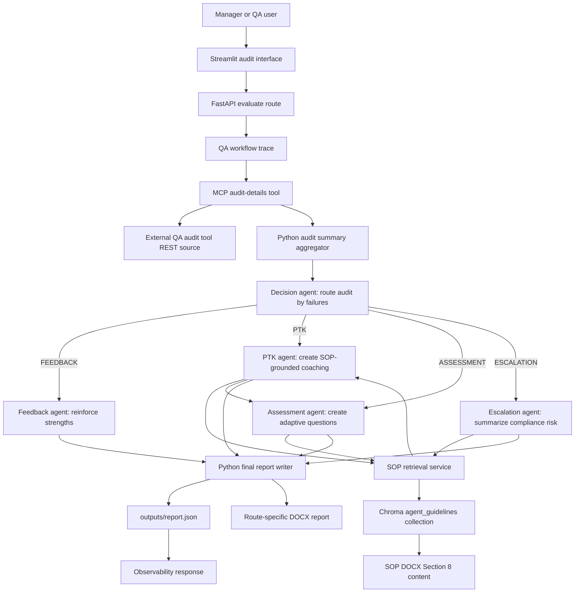

# Intelligent Agent Coaching Platform

An agentic QA coaching platform that turns credit-repair audit results into SOP-grounded feedback, training, assessments, or escalations.
Sarika Malegave, 23 August 2026, Mentora - Agent Coaching Engine.

## 1. Executive Summary

The Intelligent Agent Coaching Platform processes a quality-assurance audit for a consumer credit-repair call, identifies failed parameters and fatal breaches, retrieves relevant operating-procedure guidance, and selects an appropriate coaching response. It is intended for managers, team leads, and QA stakeholders who need actionable follow-up without manually translating every audit into training material. A decision agent routes each audit to positive feedback, a Personalized Training Kit (PTK), an assessment, or escalation. Supporting agents produce SOP-grounded content, while Python aggregation and a fatal-failure guardrail retain deterministic control of key routing behavior.

The repository demonstrates one persisted escalation artifact for audit `1746066`: two fatal failures, an 88.9% pass rate, an 88.9 effective score, and CRITICAL severity. The implementation also records an important design finding: metadata-filtered vector retrieval was selected after semantic-only retrieval returned unnecessarily broad context. System-level quality, latency, and repeatability results were not measured, and no numeric cost snapshot is committed, so the artifact must not be treated as a benchmark.

## 2. Problem and Users

QA audit systems can identify that a credit-repair call failed, but the result still leaves managers with manual work: determine whether the issue is coachable or requires escalation, locate the relevant SOP, explain the correct behavior, and prepare a useful follow-up activity. This is especially sensitive when a failure involves caller verification, confidentiality, compliance, or disclosure of personal information. A score alone can hide the operational difference between an ordinary coaching opportunity and a fatal breach.

The intended users are managers, team leads, and QA or compliance stakeholders responsible for reviewing agent performance and deciding what happens next. Agents are the subjects of the generated feedback, training kits, or assessments; they are not the primary operators of the workflow. The current interface accepts audit context and returns a report plus generated DOCX artifacts.

An agentic workflow is useful because the response is conditional and role-specific rather than a single fixed transformation. A clean audit needs strengths-only feedback; a small number of non-fatal failures needs focused coaching; more than three non-fatal failures suggests an assessment; and any fatal failure requires escalation. The system combines model-based language generation with deterministic aggregation and a fatal guardrail. A plain script could implement thresholds and templates, but would be less suitable for converting varied audit observations and retrieved SOP material into concise, individualized coaching conversations, PTKs, assessments, and escalation recommendations.

## 3. Scope

**In scope**

- Fetching audit details through an MCP tool backed by the audit tool's REST source.
- Aggregating met and failed QA subparameters, scores, error types, and fatality in Python.
- Routing to feedback, PTK, assessment, or escalation.
- Retrieving SOP guidance from Chroma using category/subcategory metadata with semantic fallback.
- Generating structured outputs for coaching, questions, and escalation recommendations.
- Persisting JSON and route-specific DOCX reports.
- Recording token and cost observability spans when configured.

**Out of scope**

- Replacing the source audit tool or defining QA policy.
- Automatic legal or regulatory interpretation.
- A production-grade identity, secrets, network, or deployment solution.
- Automated remediation of an agent or customer account.
- A validated benchmark of quality, cost, latency, or business impact.
- Proving that generated recommendations are legally sufficient without human review.

## 4. Architecture

1. A manager or QA user submits audit context through the Streamlit interface. The FastAPI service authenticates the request and checks the authorized employee context.
2. The workflow opens a parent trace and invokes the MCP `get_audit_details` tool with process ID, evaluation date, and audit ID. The MCP server obtains audit data from the configured external audit-tool endpoint.
3. `AggregateAuditSummary` reads each parameter and subparameter in Python. It separates strengths from weaknesses, counts failures, calculates pass rate and effective score, and identifies `FATAL` failures from the audit data.
4. The decision agent receives only the aggregate summary and returns one structured route. If the summary contains any fatal failure, the workflow forces `ESCALATION` even if the model selected another route.
5. Feedback writes strengths-only coaching. PTK builds SOP search queries for failures, retrieves context, and asks the PTK agent for training content. Assessment first builds PTK content and then asks the assessment agent to create three MCQs and one scenario question. Escalation uses PTK content as SOP-grounded context for risk and recommended actions.
6. The final Python node persists a common JSON report and the selected branch writes a route-specific DOCX report. The API returns completion information and observability data.

## 5. Agent Design

| Agent | Role | Tools it may call | When it hands off | How it terminates |
|---|---|---|---|---|
| `decision_agent` | Classifies the aggregate audit into a response route | No direct tool; receives the Python summary | Hands off to exactly one route based on failure count and fatality | Returns validated `DecisionResult` JSON |
| `ptk_agent` | Produces a Personalized Training Kit for a failed area | Receives retrieved SOP context through the PTK builder | Returns PTK content to the PTK, assessment, or escalation node | Returns validated `PTKResult` JSON |
| `assessment_agent` | Converts PTK content into targeted knowledge checks | Receives PTK objects; no direct external tool | Returns assessment content to the final writer | Returns validated `AssessmentResult` JSON |
| `feedback_agent` | Reinforces strengths for a clean audit | No direct tool; receives met parameters and summary | Returns positive feedback to the final writer | Returns validated `FeedbackResult` JSON |
| `escalation_agent` | Describes fatal breaches, risk, ownership, and actions | Receives fatal weaknesses and SOP-grounded PTK context | Returns escalation content to the final writer | Returns validated `EscalationResult` JSON |
| `sop_query_agent` | Shapes a failed parameter into a useful SOP retrieval query | No direct tool; called by `DecisionHelper` | Hands its query to the retrieval builder | Returns a query string used for retrieval |

The design separates classification from content generation. The decision agent sees a compact, deterministic summary instead of raw audit prose, which makes the route policy explicit and allows Python to enforce the highest-risk rule. The fatal guardrail is deliberately outside the model: any fatal failure must escalate regardless of confidence or score.

The downstream branches have different responsibilities. Feedback does not retrieve SOP material because a clean audit needs reinforcement rather than corrective training. PTK is the central corrective artifact. Assessment reuses PTK output as its source of truth, reducing the chance that questions drift from the coaching material. Escalation receives PTK context only to ground risk and recommended actions; it does not attach the full PTK as its output.

Structured Pydantic response formats constrain each agent's interface, while DOCX generation and final JSON persistence remain Python responsibilities. This keeps file handling and aggregation outside the model. The helper agent is intentionally narrow: it improves retrieval-query formulation without deciding the route or writing the final report.

## 6. Data and Knowledge

The runtime audit comes from an external QA audit tool accessed through a configured REST URL behind the MCP `get_audit_details` tool. The repository does not contain the external endpoint's returned dataset or credentials. The committed local audit index contains 4 audit records, and the local user file contains 9 records: 4 agents, 3 team leads, and 2 managers. The only committed SOP source is `data/sop/credit_repair_qa_sop.docx`, a 69,423-byte DOCX. Its page count is not measured in the repository.

`rag/ingest.py` parses Section 8 of the SOP into documents and stores them in the Chroma collection `agent_guidelines`. The persisted Chroma database is present, but the number of indexed documents or chunks is not measured. Retrieval first normalizes category and subcategory values and attempts exact metadata matching. If that does not produce sufficient context, it uses semantic retrieval with Amazon Titan embeddings. Retrieved context is capped at 3,500 characters, and retrieval work is throttled to five concurrent tasks.

The prompts contain the stable behavior policy: route definitions, fatality precedence, output schemas, and instructions to ground PTK, assessment, and escalation content in the provided SOP. Runtime retrieval supplies the case-specific SOP content for failed parameters. Audit observations, scores, failure types, tenure, target, and agent context come from the request and aggregation; they are not hard-coded into the prompts.

## 7. Implementation

The platform is implemented in Python 3.12 or newer. FastAPI provides the service API, Streamlit provides the interface, Microsoft Agent Framework supplies the workflow and agent integration, MCP provides the audit-data tool boundary, Chroma stores SOP retrieval data, LangChain AWS supplies Titan embeddings, and `python-docx` produces reports. AWS Bedrock hosts `anthropic.claude-sonnet-4-5-20250929-v1:0` for agent generation and `amazon.titan-embed-text-v2:0` for embeddings in `us-east-1`. Langfuse and OpenTelemetry integration provide optional observability.

The first significant decision was to use a multi-agent routed workflow. A single prompt or monolithic agent was rejected because feedback, training, assessment, and escalation have different safety and output requirements; explicit branches make the policy and handoffs inspectable.

The second decision was to keep aggregation and fatal routing protection in Python. Allowing the model to calculate all scores and decide fatality was rejected because arithmetic and high-risk escalation should be deterministic. The model still supplies structured reasoning, but the fatal guardrail overrides an unsafe route.

The third decision was to combine metadata-filtered retrieval with semantic fallback. Semantic-only search was tried and rejected because it returned unnecessarily large context. Exact category/subcategory filtering is more targeted for known QA parameters, while semantic fallback preserves retrieval coverage when metadata is incomplete.

A further implementation choice was to use structured Pydantic outputs and Python report writers rather than asking agents to format DOCX or unstructured text. This makes downstream serialization predictable and keeps file creation outside generated content.

## 8. Evaluation

 Cost is measured per request by the observability layer: `usage_since()` calculates USD from captured input and output token spans using the configured Claude and Titan pricing table, with per-agent, RAG, and tool breakdowns. However, no numeric cost snapshot for the persisted report is committed. No latency metric was calculated. No failure-rate metric was calculated. The available persisted report is an implementation artifact for one audit, not an evaluation protocol: it shows that a particular input produced a structured escalation result, but it does not establish accuracy, consistency, or generalization.

The intended future evaluation should include clean audits, one to three non-fatal failures, more than three non-fatal failures, and fatal compliance or confidentiality failures. It should score route correctness with a code check against the documented policy, structured-output validity with a code check, SOP grounding and usefulness with human or model-judge review, and cost and latency from observability traces. Each case should be run a recorded number of times under fixed model and environment settings. Those procedures were not carried out for this report.

## 9. Results

The following table contains measured values from the single persisted artifact in `outputs/report.json`; it is not a system-level benchmark.

| Artifact | Audit ID | Route | Total subparameters | Failed parameters | Fatal failures | Pass rate | Effective score | Severity |
|---|---:|---|---:|---:|---:|---:|---:|---|
| Persisted escalation report | 1746066 | ESCALATION | 18 | 2 | 2 | 88.9% | 88.9 | CRITICAL |

The artifact records two failures in `INFORMATION AND CONFIDENTIALITY`: non-compliance with verification procedures and non-compliance with confidentiality requirements. It recommends escalation to the Compliance Team. The report also records a raw `quality_scored` value of 0.0 while calculating an effective score of 88.9 from the points ratio; these are different fields and should not be conflated.

